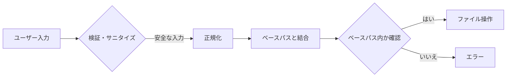

## Webアプリの隠れた脅威！パストラバーサル攻撃とディレクトリリスティングの徹底解説

## はじめに
皆さんが開発するWebアプリケーションには、気づかぬうちに重大な脆弱性が潜んでいる可能性があります。特に**パストラバーサル（Path Traversal）** と**ディレクトリリスティング（Directory Listing）** は、システム内部の機密ファイルを盗まれるリスクを生み出します。実際に2021年には、Apache HTTP Serverのパストラバーサル脆弱性(CVE-2021-41773)が深刻な被害をもたらしました。これらを理解せずに開発すると、顧客データ漏洩やシステム乗っ取り事故を引き起こす可能性があります。

## 前提知識
### ファイルシステムの基本構造
OSはファイルを**ディレクトリ（directory）** と呼ばれる階層構造で管理します。ルートディレクトリ(`/` または `C:\`)から始まるツリー構造で、パス（Path）で位置を指定します。

```
ルートディレクトリ（/）
├── home/
│   └── user/
│       ├── docs/  ← カレントディレクトリ
│       │   ├── report.txt
│       │   └── image.jpg
│       └── downloads/
└── etc/
    └── passwd  ← 機密ファイル
```

### 相対パス vs 絶対パス
- **絶対パス（Absolute Path）**: ルートから始まる完全なパス（例: `/home/user/docs/report.txt`）
- **相対パス（Relative Path）**: 現在位置（カレントディレクトリ）からのパス（例: `../downloads/file.zip`）

⚠️ **試験頻出**: 相対パスで親ディレクトリを表す `../` が攻撃の鍵に！

## 基本概念
### パストラバーサル攻撃とは？
ユーザー入力からファイルパスを生成する際、`../` を利用して意図しないディレクトリにアクセスする攻撃です。

```php
// 脆弱なコード例
$file = $_GET['file']; // ユーザー入力（例: "../../etc/passwd"）
readfile("/home/user/docs/" . $file);
```

想定パス:  
`/home/user/docs/../../etc/passwd` → 正規化で `/etc/passwd` に変換

ASCIIフロー:
```
[ユーザー入力] → "..%2F..%2Fetc/passwd" 
    ↓
[デコード]     → "../../etc/passwd"
    ↓
[パス結合]     → "/base/dir/../../etc/passwd"
    ↓
[正規化]       → "/etc/passwd" ⚠️機密ファイルにアクセス！
```

### ディレクトリリスティングとは？
Webサーバーの設定ミスで、ディレクトリ内のファイル一覧が表示される脆弱性です。

```
ディレクトリ: /internal/files/
Index of /internal/files
────────────────────────────
- secret_backup.zip
- user_credentials.db
- admin_notes.txt
```

**たとえ話**: 金庫の扉が開いている上に、中の物品リストまで貼り出されている状態

## 技術的な深堀り
### パス正規化の仕組み
OSはパスを解決する際、以下の正規化を行います（RFC 3986 §5.2.4参照）：
1. `./` の除去: `/home/./user` → `/home/user`
2. `../` の処理: `/docs/../etc` → `/etc`
3. 冗長な区切り文字の除去: `//dir//file` → `/dir/file`

⚠️ **攻撃の盲点**: `..%2F` (URLエンコード) → `../` にデコードされる

```python
# 脆弱性検査用アルゴリズム（NIST SP 800-115より）
def is_vulnerable(input_path):
    normalized = os.path.normpath(input_path)
    base_dir = "/safe/dir"
    full_path = os.path.join(base_dir, normalized)
    return not full_path.startswith(base_dir)  # ベースディレクトリ外なら危険
```

### ディレクトリリスティング発生条件
```
[リクエスト] → GET /directory/ （末尾スラッシュ）
    ↓
[サーバー処理]
    ├── index.html 存在？ → 表示
    ├── 存在しない & DirectoryListing ON → 一覧表示 ⚠️危険！
    └── DirectoryListing OFF → 403 Forbidden
```

**設定例（Apache）**:
```apache
# 安全な設定（ディレクトリリスティング無効化）
Options -Indexes
```

## 攻撃・脆弱性の観点
### パストラバーサルの攻撃フロー
```
攻撃者 ─[1. 悪意あるリクエスト]→ Webアプリ
    （例: /download?file=../../etc/passwd）
        ↓
Webアプリ ─[2. 正規化された不正パス]→ ファイルシステム
        ↓
ファイルシステム ─[3. 機密ファイル返却]→ 攻撃者
```

**有名事例**:
- CVE-2021-41773: Apache 2.4.49 パストラバーサル（ルート権限取得可能）
- CVE-2014-3529: Spring Framework のパストラバーサル

### ディレクトリリスティングの悪用
```
攻撃者 ─[1. ディレクトリ直アクセス]→ サーバー
    （例: https://example.com/internal/）
        ↓
サーバー ─[2. ファイル一覧応答]→ 攻撃者
        ↓
攻撃者 ─[3. 機密ファイルダウンロード]→ サーバー
    （例: https://example.com/internal/backup.sql）
```

## 対策・ベストプラクティス
### パストラバーサル対策


1. **入力検証**:
   ```python
   # 安全なファイル名チェック（正規表現）
   if not re.match(r'^[\w\-]+\.txt$', filename):
       raise InvalidInputError()
   ```

2. **正規化後のチェック**（NIST推奨）:
   ```java
   Path base = Paths.get("/safe/dir");
   Path resolved = base.resolve(userInput).normalize();
   if (!resolved.startsWith(base)) {
       throw new SecurityException("Invalid path");
   }
   ```

### ディレクトリリスティング対策
- Webサーバー設定で `Indexes` オプションを無効化
- 各ディレクトリに空の `index.html` を配置
- 自動生成されるディレクトリを公開領域外に設置

## 📝 試験対策ポイント

| 項目 | パストラバーサル | ディレクトリリスティング |
|------|------------------|------------------------|
| **本質的リスク** | 任意ファイル読取 | 非公開ファイル一覧取得 |
| **発生条件** | ユーザー入力がパスに直結 | インデックスファイル不在 + 設定不備 |
| **主要対策** | 入力検証 + 正規化後チェック | `Options -Indexes` 設定 |
| **関連規格** | NIST SP 800-53 SI-10 | OWASP A05:2021 |
| **引っかけポイント** | URLエンコード二重化(`..%252F`) | シンボリックリンク経由の情報漏洩 |

⚠️ **頻出引っかけ**:  
「入力時に `../` を除去すれば安全」 → ×  
正規化前の除去では `..././` 等の変種を防げない

## まとめ
パストラバーサルとディレクトリリスティングは、システム内部への不正アクセスを許す重大脆弱性です。対策の核心は「**ユーザー入力をパスとして信用しないこと**」と「**最小権限原則の徹底**」にあります。支援士試験では対策手法の実装レベルの理解が求められます。次に学ぶテーマとして「**ファイルアップロード機能の脆弱性対策**」を推奨します。安全なWebアプリ開発のために、これらの防御技術を習得してください。

> この記事が役立った方は「いいね」をお願いします！  
> 質問はコメント欄へ。次回テーマリクエストも受付中！