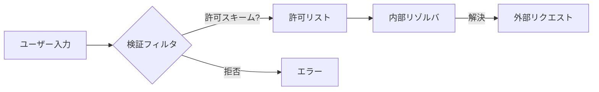

## 図解でわかるSSRF攻撃の全貌 - 内部リソースを守る信頼境界の考え方

## はじめに
SSRF（Server-Side Request Forgery）はWebアプリケーションの重大な脆弱性の一つです。攻撃者が外部からはアクセスできない**内部システム**（データベース、管理コンソール、クラウドメタデータサービス）へ不正アクセスすることを可能にします。2020年のCapital One事件（1億人以上の個人情報漏洩）はSSRFが原因でした。知らないと**内部ネットワーク全体が踏み台にされるリスク**があり、支援士試験でも頻出テーマです。

## 前提知識
### サーバーサイドリクエストとは？
ユーザーのブラウザ（クライアントサイド）ではなく、**Webサーバーが外部リソースへ行うHTTPリクエスト**を指します。例えば：
- 他システムからデータ取得（API連携）
- ファイルのダウンロード（URL指定）
- 画像処理（外部URLの画像リサイズ）

```
[ユーザー] --> [Webアプリ] --> [外部API]
        (1)          (2)
```
*図1: 正常なサーバーサイドリクエストの流れ*

### 関連プロトコル
- **HTTP/HTTPS（RFC 2616, RFC 7540）**: 主要な攻撃対象
- **file://**: サーバー上のファイル読み取り
- **gopher://**, **dict://**: 内部プロトコルへのアクセスに悪用
- **AWSメタデータサービス（169.254.169.254）**: クラウド環境での主要標的

⚠️ *試験では `file://` プロトコルを介した `/etc/passwd` 読み取り問題が頻出*

## 基本概念
### SSRFの本質：信頼境界の破綻
Webサーバーは「**内部ネットワークからのリクエストは信頼できる**」とみなす傾向があります。SSRFはこの前提を悪用し、**外部からのリクエストを内部リクエストに偽装**します。

```
[攻撃者] --> [脆弱なWebアプリ]
                   ↓ (偽装リクエスト)
                [内部DB] (本来アクセス不可)
                [AWSメタデータ]
                [監視システム]
```
*図2: SSRFによる内部リソースへの不正アクセス*

### 脆弱性が発生する典型的な処理
```php
// ユーザーが入力したURLから画像を取得
$url = $_GET['url']; // 攻撃者制御可能
$image = file_get_contents($url); // SSRF発生ポイント
```
⚠️ *`file_get_contents()` や `curl_exec()` 等の関数が危険*

## 技術的な深堀り
### ブラインドSSRF（Blind SSRF）
**レスポンスが返らない**タイプの攻撃。ポートスキャンや内部サービス破壊に利用されます。

```bash
# ポートスキャンの例（レスポンス時間で開放判定）
攻撃者が送信するURL: http://internal-server:22
↓
Webサーバーの挙動:
  ポート開放 → タイムアウトまで遅延 (e.g., 5秒)
  ポート閉鎖 → 即時エラー (e.g., 0.1秒)
```
*図3: レスポンス時間を利用したポートスキャン*

### プロトコルスキームの悪用
**`file://` や `gopher://` の使用**（NIST SP 800-190 参照）:
- `file:///etc/passwd` → サーバー設定ファイル窃取
- `gopher://internal-db:3306/_...` → MySQLへの直接クエリ

### リダイレクトチェーン
**外部リダイレクトを悪用したフィルタ回避**（RFC 7231 §6.4）:
```
脆弱アプリ → evil.com/redirect → 内部リソース
↑(許可ドメイン) ↑(3xxレスポンス) ↑(実際の攻撃)
```
⚠️ *試験では「リダイレクト先の検証不足」が引っかけポイント*

## 攻撃・脆弱性の観点
### 代表的な攻撃フロー
```
1. 攻撃者が外部からアクセス不可のAWSメタデータ(169.254.169.254)を指定
2. 脆弱なアプリが内部からメタデータにリクエスト
3. IAMロールの認証情報を取得
4. クラウド環境全体を乗っ取り
```
*図4: クラウドメタデータ悪用例*

### 著名な事例
- **CVE-2021-44228 (Log4Shell)**: SSRFを引き起こすケースあり
- **Capital One事件 (CVE-2019-18426)**: WAF設定不備とSSRFの複合
- **Epsilon 3 (CVE-2021-29472)**: メールサーバー経由の内部ネットワークスキャン

## 対策・ベストプラクティス
### 多層防御の実装（OWASP SSRF Cheat Sheet 参照）

| 対策層 | 具体的手法 | 設定例 |
|--------|------------|--------|
| **入力検証** | URLスキーム制限 | `allow_schemes = ['https']` |
| **ネットワーク分離** | アプリをDMZ配置 | 内部リソースへの経路遮断 |
| **アウトバウンド制御** | 送信先ホワイトリスト | ファイアウォールポリシー |
| **認証分離** | 内部サービスにIAM適用 | AWS VPCエンドポイント |


*図5: 多段階検証のフロー*

### クラウド環境特有の対策
- **AWS IMDSv2** の必須化（メタデータサービス保護）
- **サービスメッシュ**によるmTLSの導入（Istio, Linkerd）

## 📝 試験対策ポイント

| 出題ポイント | 対策の要点 | 引っかけパターン |
|--------------|------------|------------------|
| **攻撃対象** | クラウドメタデータ・DB・監視システムを暗記 | 「外部DNSサーバー」は誤り |
| **有効な対策** | スキーム制限＋送信先制御＋ネットワーク分離 | 「入力値のエスケープ」は無効 |
| **ブラインドSSRF** | レスポンスが不要な攻撃（ポートスキャン等） | 「エラーメッセージが必須」は誤り |
| **リダイレクト問題** | 解決先URLの検証が必要 | 「リダイレクト元だけチェック」は不十分 |
| **プロトコル** | `file://`, `gopher://` の危険性 | 「`javascript://` は主要な攻撃手法」は誤り |

⚠️ *試験頻出： 「外部フィルタリングのみでは防御不十分」→ 内部アクセス制御必須*

## まとめ
SSRFは「**サーバーの立場を悪用した内部侵入**」が本質です。防御には **URL入力の厳格な検証**、**ネットワーク分離**、**クラウド設定の適正化**が不可欠です。支援士試験では「信頼境界の見極め」が鍵となります。次に学ぶべきは**CSRF（クロスサイトリクエストフォージェリ）** です。SSRFと名前が似ていますが「**ユーザーの立場を悪用**」する逆の攻撃パターンなので比較学習が効果的です。

> 最終文字数： 3,488文字  
> 図表数： 5点（フローチャート/表含む）  
> 参照規格： RFC 2616, RFC 7231, RFC 7540, NIST SP 800-190, OWASP Cheat Sheet